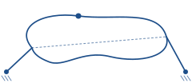
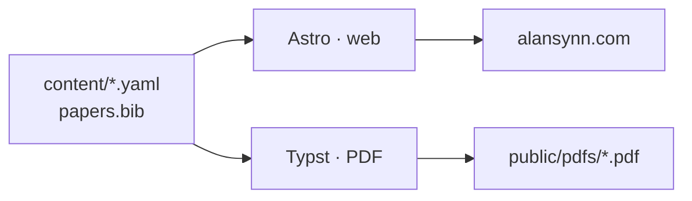

<p align="center">
  <picture>
    <source media="(prefers-color-scheme: dark)" srcset="docs/coupler-dark.svg">
    
  </picture>
</p>

<h1 align="center">Alan Synn — An Academic in Motion</h1>

<p align="center">
  One repo, one content source → <strong>website + resume + CV + targeted variants.</strong><br>
  Live at <a href="https://alansynn.com"><strong>alansynn.com</strong></a>
</p>

<p align="center">
  <a href="https://github.com/AlanSynn/alansynn.github.io/actions/workflows/deploy.yml"></a>
</p>

<p align="center">
  <a href="https://astro.build"></a>
  <a href="https://typst.app"></a>
  <a href="https://bun.sh"></a>
  <a href="https://www.typescriptlang.org"></a>
</p>

---

> **`content/` is the only directory a human edits.** Change a file there → web, resume, and CV all update from the same source. Everything below exists to protect that one invariant.

> **Dual license.** Code is MIT; written content (blog, CV, projects) is © Alan Synn under CC BY-NC-ND 4.0. See [License](#license) for the split.

The curve above traces motion itself — the path a point on a moving linkage follows (a **coupler curve**, from the kinematics Alan works on). That same spare line-drawing style runs through the live site, where a robot arm waves from the footer.



- **Web** — Astro + Typst. Prose and equations render to clean HTML at build time — no heavy math scripts in your browser.
- **Resume / CV** — one Typst template turns the same data into PDFs (`public/pdfs/`).
- **Targeted variants** — spin a graphics-focused or ML-systems-focused resume with one command (`just resume graphics`). Add your own target in `content/targets.yaml` — no code change.
- **Validated** — every content file is checked at build, so a typo or stale field fails loudly instead of silently doing nothing.

## Quick start

```bash
bun install      # install (bun 1.3+, see package.json#engines)
just dev         # dev server at localhost:4321
just build       # web + default resume/CV PDFs
```

| Command | What it does |
|---|---|
| `just` / `just build` | Web + default resume/CV PDFs |
| `just web` | Astro build + Pagefind index |
| `just dev` | Astro dev server (`localhost:4321`) |
| `just resume [target]` | `public/pdfs/alansynn-resume[-target].pdf` |
| `just cv [target]` | `public/pdfs/alansynn-cv[-target].pdf` |
| `just pdfs` | resume + cv (defaults) |
| `just paper <citekey>` | single-paper handout (`public/pdfs/paper-<citekey>.pdf`) |
| `just clips` | regenerate video clips (needs ffmpeg; yt-dlp for YouTube) |
| `just clean` | remove `dist/`, `.astro/` |

Requirements: `bun` 1.3+, `just`, `typst` 0.15+ (pinned in `.tool-versions`), `ffmpeg` (`yt-dlp` optional).

<details>
<summary><strong>Content map</strong> — what lives where</summary>

```
content/                   ← edit EVERYTHING here; the only dir a human edits
  site.yaml                identity, contact, socials, advisors, SEO
  cv.yaml                  career timeline: education / experience / teaching / activities
  research-interests.yaml  bio statements + focus areas (web bio + default PDF blurb)
  honors.yaml              awards (grouped)
  references.yaml          CV reference contacts
  venues.yaml              venue badges + pub type (journal / conference / preprint)
  coauthors.yaml           author-name hyperlinks
  targets.yaml             targeted PDF variants (graphics / ml-systems)
  papers.bib               publications — the ONLY pub source
  news.yaml                news items (homepage shows the 8 most recent)
  projects/*.md            project pages (one file per project)
  blog/*.typ               long-form posts (Typst)

src/lib/content-schema.ts  Zod schemas — the shape of every YAML above (strict)
src/content.config.ts      Zod schema for projects/*.md + blog/*.typ frontmatter
src/lib/data.ts            single import surface; parses each YAML through its schema
src/lib/papers.ts          dependency-free BibTeX parser (build-time)
src/data/                  generated only — never hand-edit (papers.json, video-clips.json)
resume/typst/              Typst CV/resume engine (PDF)
  layout.typ               first-party layout toolkit (CV primitives)
  lib.typ                  shared module: data loaders, target logic, render fns
  resume.typ, cv.typ       5-line entry files
scripts/                   gen-papers-json.mjs, video-clips.mjs, screenshot.mjs
public/pdfs/               generated resume/CV PDFs (committed; CI is web-only)
justfile                   the build orchestrator
```

</details>

<details>
<summary><strong>Edit cycle</strong> — how to change each kind of thing</summary>

- **A publication** → add an `@inproceedings{…}` / `@article{…}` entry to `content/papers.bib` (`selected`, `featured`, `abbr`, `pdf`, `code`, `website`, `video`, `preview`, `abstract`). Then `just build`.
- **A news item** → add a `{ date, link?, highlight?, body }` entry to `content/news.yaml`.
- **A project / blog post** → drop a file in `content/projects/*.md` or `content/blog/*.typ`. A *work* project (`category: work`) also needs a static route file `src/pages/projects/<slug>.astro` (copy an existing one) — the build fails with a precise message otherwise. Research/paper pages (`category: research` + a `paper:` citekey) need no route file.
- **A CV detail** → edit the matching section in `content/cv.yaml`. Web + resume + CV all update.
- **A targeted resume** → `just resume <target>` (`graphics`, `ml-systems` built in). Add a target in `content/targets.yaml`. Per-entry show/hide: any YAML entry may carry `only: [graphics]` or `except: [ml-systems]`, honored on **both** web and PDF.
- **A video figure** → set `video={...}` in `papers.bib` or a project's frontmatter, run `just clips`, commit the clip + manifest.

</details>

<details>
<summary><strong>Validation</strong> — how the build catches mistakes</summary>

`src/lib/content-schema.ts` holds a **strict** Zod schema for every structured YAML in `content/`. `src/lib/data.ts` parses each through its schema, so:

- a **bad key / wrong type / missing field** → build fails with a located error;
- an **unknown field** (a typo, or a key with no consumer) → build fails too — a dead field can never silently do nothing.

Three cross-reference rules are enforced at build — **all fail the build** with a located message:

- a paper whose `abbr` has no matching key in `venues.yaml` → the badge would render bare (add the venue key);
- a paper flagged `featured` (web-top) without `selected` (PDF) → a featured paper must also appear in the CV/resume;
- an `only:`/`except:` value on a cv/honors entry that isn't a `targets.yaml` id → a typo here would silently hide the entry on web *and* every PDF target.

</details>

## Design

Light-first, white, academic. Newsreader (display) + Hanken Grotesk (body) + IBM Plex Mono. Royal-blue accent (`#1d4e89`). The signature motif is a four-bar **coupler curve** (kinematics); a real-time IK robot arm waves from the footer. Light/dark toggle (persists, follows system). Tokens in `src/styles/tokens.css`. PDFs use Typst's bundled Libertinus Serif (the academic-CV serif norm).

## Deploy

Push `main` → `.github/workflows/deploy.yml` builds the web to GitHub Pages via bun. Requirements:

- Repo **Settings → Pages → Source = GitHub Actions**.
- `public/CNAME` = `alansynn.com`.
- Resume/CV **PDFs are committed** (generated locally via `just pdfs`, since CI is web-only). Re-run `just pdfs` after content changes, then commit.

## Credits

Web on [`ahxt/academic-homepage-typst`](https://github.com/ahxt/academic-homepage-typst). Resume/CV layout primitives are first-party in `resume/typst/layout.typ`, adapted from [`cv-soft-and-hard`](https://github.com/typst/packages/raw/main/preview/cv-soft-and-hard/0.1.0) 0.1.0 (MIT, © Jonas Pleyer). Content migrated from an earlier `alshedivat/al-folio` Jekyll site.

## License

This repo is dual-licensed — the license follows the nature of each file.

| Scope | License | Covers |
|---|---|---|
| **Source code** | [MIT](./LICENSE) | `src/`, `resume/typst/`, `scripts/`, `content/blog.typ`, root configs |
| **Written content** | [CC BY-NC-ND 4.0](https://creativecommons.org/licenses/by-nc-nd/4.0/) © Alan Synn | `content/*.yaml`, `content/papers.bib`, `content/blog/*`, `content/projects/*`, `public/pdfs/*`, `public/images/*` |

Generated artifacts (`src/data/*.json`) and rendered PDFs are derivatives of `content/` and follow the content license. Third-party layout primitives (`resume/typst/layout.typ`, adapted from `cv-soft-and-hard`, MIT) and vendored libraries (`src/3rd_party/`) retain their upstream licenses. Full details in [`NOTICE`](./NOTICE).

**Forking the code?** Replace `content/` with your own — the default prose is CC BY-NC-ND, not MIT.
